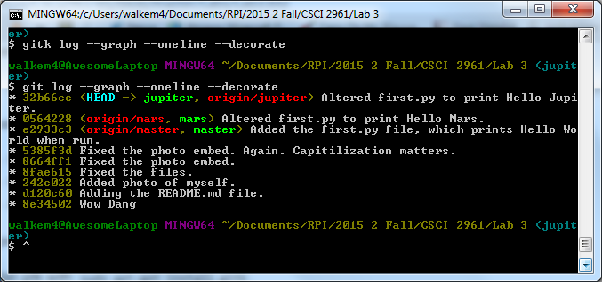
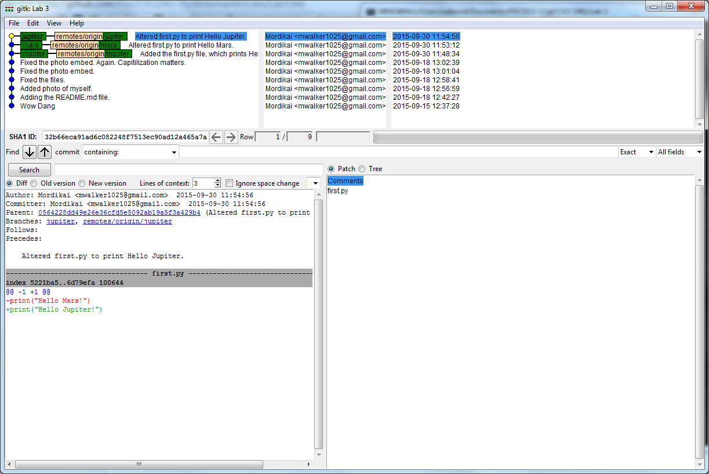

#Lab 3
###9/18/2015

Link to the repository: https://github.com/Mordikai/Lab3-Repo

Comparison of the two outputs, first from the 'git log' command, second from the 'gitk' command.

'git log' lists the commit messages and the current set of branches, and indicates whichever branch is currently being edited.
'gitk' provides the same info as 'git log', but with timestamps, and some additional details regarding the exact nature of the changes.
